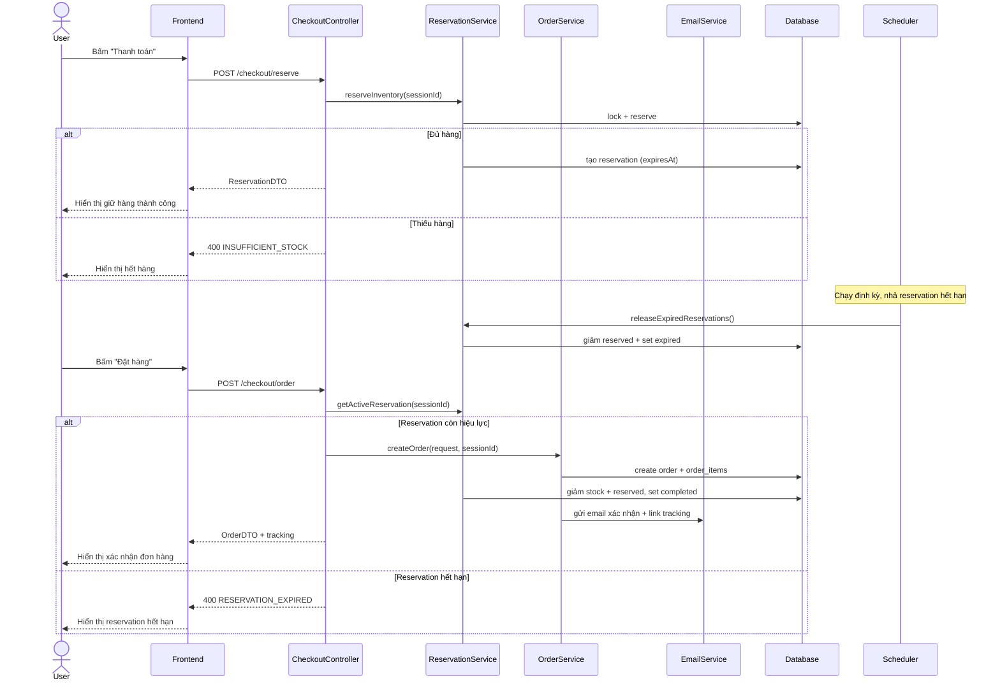

```mermaid
sequenceDiagram
    actor User
    participant FE as Frontend
    participant API as CheckoutController
    participant ResSvc as ReservationService
    participant OrderSvc as OrderService
    participant Mail as EmailService
    participant DB as Database
    participant Scheduler
    
    User->>FE: Bấm "Thanh toán"
    FE->>API: POST /checkout/reserve
    API->>ResSvc: reserveInventory(sessionId)
    ResSvc->>DB: lock + reserve
    alt Đủ hàng
        ResSvc->>DB: tạo reservation (expiresAt)
        API-->>FE: ReservationDTO
        FE-->>User: Hiển thị giữ hàng thành công
    else Thiếu hàng
        API-->>FE: 400 INSUFFICIENT_STOCK
        FE-->>User: Hiển thị hết hàng
    end
    
    Note over Scheduler: Chạy định kỳ, nhả reservation hết hạn
    Scheduler->>ResSvc: releaseExpiredReservations()
    ResSvc->>DB: giảm reserved + set expired
    
    User->>FE: Bấm "Đặt hàng"
    FE->>API: POST /checkout/order
    API->>ResSvc: getActiveReservation(sessionId)
    alt Reservation còn hiệu lực
        API->>OrderSvc: createOrder(request, sessionId)
        OrderSvc->>DB: create order + order_items
        ResSvc->>DB: giảm stock + reserved, set completed
        OrderSvc->>Mail: gửi email xác nhận + link tracking
        API-->>FE: OrderDTO + tracking
        FE-->>User: Hiển thị xác nhận đơn hàng
    else Reservation hết hạn
        API-->>FE: 400 RESERVATION_EXPIRED
        FE-->>User: Hiển thị reservation hết hạn
    end
```